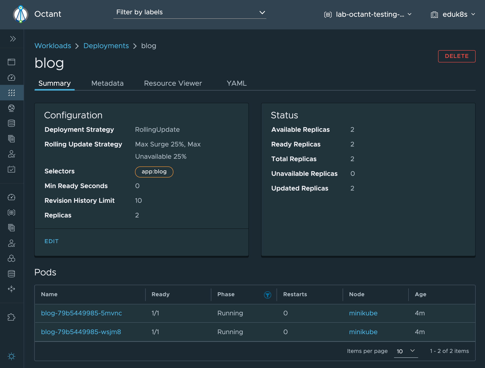
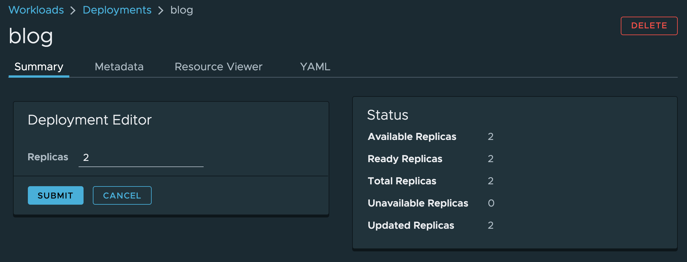

The primary view in Octant is the **Overview** page. This provides a view of all namespaced resource in a selected namespace.

In our case you can see the resources for the blog application and database you just deployed.

If you want to work with a different namespace, you can use the drop down list in the top navigation bar of Octant. In this workshop environment, although you can see a list of other namespaces, if you change to another namespace, you will not be able to view any of the namespaced resources of the namespaces as role based access control (RBAC) for this workshop environment doesn't permit you access. So stick with the ``{{session_namespace}}`` namespace.

From the overview, you can click on the names of specific resources under each category shown. This allows you to drill down to more details of that specific resource.

Click on ``blog`` under the **Deployments** card of the overview.

Here you can view details on a deployment, including a summary, resource metadata and the raw YAML. Right now you can only view the YAML description, but the ability to edit the raw YAML is on the roadmap for Octant.

Independent of editing the raw YAML, dependent on the resource type, you may have the ability to edit select details. In the case of a deployment, clicking on **EDIT** within the **Configuration** card, will allow you to adjust the number of replicas for the deployment.

The deployment editor will temporarily replace the configuration card when making changes.

Set the number of replicas to 1 and submit the change, otherwise cancel out of the deployment editor.
