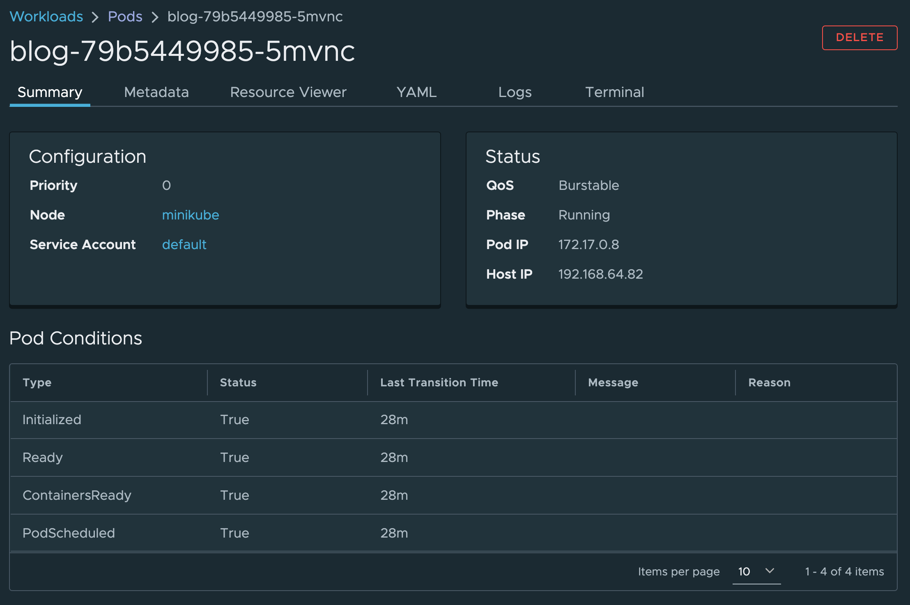
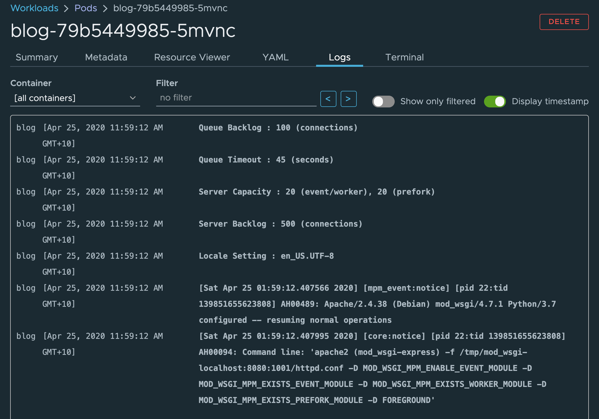

Most of the time when trying to work out what an application is doing, you will be interacting with a pod. A pod is the set of containers making up a single instance of your application.

Switch back to the list of pods in the namespace by clicking on the **Overview->Workloads->Pods** category in the left hand side menu.

From the list of pods, select a pod from the blog application. These are the pod entries with the ``app:blog`` label.

The pod details page gives access to a range of information about the pod and the containers it comprises.

To access the logs for a pod, click on the **Logs** tab.

This is the same as you would be able to access when using ``kubectl logs`` from the command line.

If a pod consists of more than one container, you may need to select the specific container you are interested in from the dropdown.

By default timestamps are shown for when log messages were captured from the container. You can disable this if required, such as if the application itself adds timestamps and having both is confusing.
